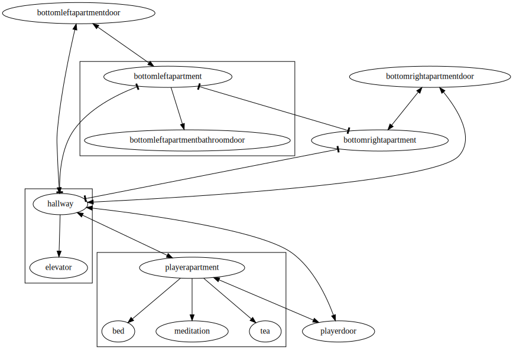

Main protagonist's apartment is a place where several minigames can be played.

- We have the [meditation](../meditation) minigame where the player controls Hoshi.
- We have the not yet implemented tea brewing minigame.
- When the player goes to sleep, there will be the a dream minigame most likely.

There's a hallway with an elevator that leads to the downtown area or other floors.

