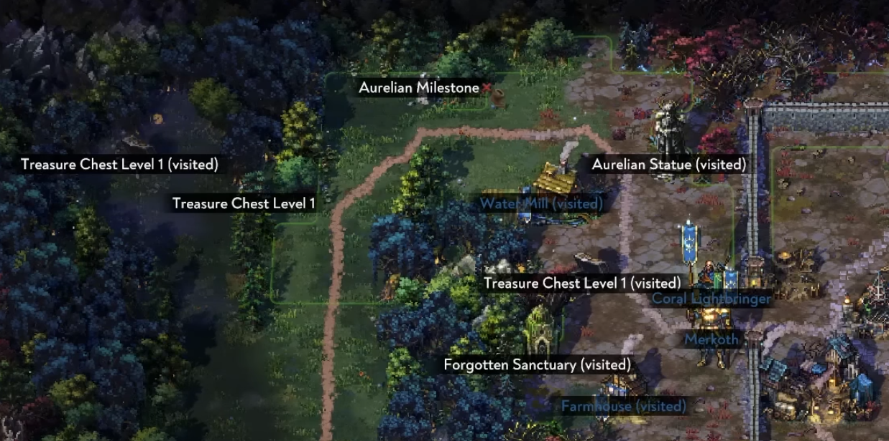

# Inspecting the world

Interacting with different objects and NPCs is a ubiquitous action in any top down scene.

Our goals:

- you must know what will happen if they begin an interaction by hitting the respective button
- you should have clarity about what's within their reach
- you shouldn't have to walk around to position themselves in a way that allows them to interact with an object when multiple objects are close to each other

We considered other solutions:

- When you are close to an object, the object that would be interacted with is highlighted. This does not give clarity about your surrounding nor does it avoid repositioning.
- Your character has an emoji above their head that indicates the type of interaction that is possible. This falls short in the same way as the previous solution.

Our preferred solution is to show text labels on objects and NPCs.

In many games there is a special button to press, typically `Alt`, to activate the inspection mode.
Monika likes the idea of not having the inspection mode always on.
Michael is annoyed when he has to press a button to see what's around him.

A natural solution is to gamify the inspection mode.
It should feel less like a game settings and more like a game mechanic.

The inspection mode can be leveled up.
When you observe some object or NPC for the first time, they are highlighted.
TODO: use \*?
This increases your curiosity level, allowing you to see farther.

There are multiple categories for observable objects.
For example, you can observe plants, garbage and so on.
Each category has its own radii and the curiosity level is combined with other factors to determine the radius.
There are gadgets that can be attached to the [phone](phone.md) that can alter the inspection mode.

To avoid repositioning, we highlight the object that is closest to you.
That is the object you will interact with if you press the interaction button.
However, you can also change the highlighted object with directional input.
Press up and you go to the next object that's closest from the highlighted object in the up direction.
By allowing you to change the highlighted object you will interact with, we avoid a bug where you cannot interact with an object because it's behind another object.
