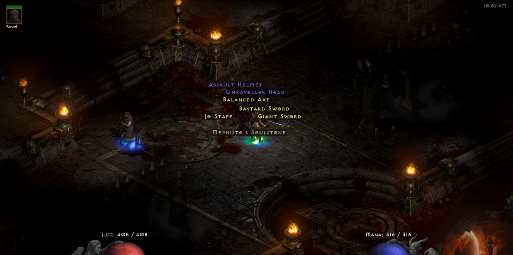

# Inspecting the World

Interacting with various objects and NPCs is a common action in any top-down scene.

Our goals are:

- You must understand the outcome of initiating an interaction by pressing the respective button.
- You should have clarity regarding what is within your reach.
- You shouldn't need to reposition yourself to interact with an object when multiple objects are nearby.

We considered alternative solutions:

- Highlighting the object that would be interacted with when you are close to it. However, this does not provide clarity about your surroundings and does not eliminate the need for repositioning.
- Having an emoji above your character's head to indicate the available type of interaction. However, this suffers from the same drawbacks as the previous solution.

Our preferred solution is to display text labels on objects and NPCs.

In many games, there is a special button to press, typically `Alt`, to activate the inspection mode.

When you press `Alt` in our game, you see proximate objects and NPCs with labels as well.
The labels fade out after a few seconds, but you can press `Alt` again to refresh the labels.
Or, you can hold `Alt` to keep the labels visible.

## Categories

Each label is in some category.
The categories change the color, font-size, radius etc.
Here's a list of categories:

- `Default`
- `Npc`

## Where does future development lead us?

Monika likes the idea of not having the inspection mode always on, while Michael is annoyed when he has to press a button to see what's around him.
A natural solution is to gamify the inspection mode, making it feel less like a game setting and more like a game mechanic.

- [x] When you observe an object or an NPC for the first time, its stored in a set of seen labels.
- [ ] The inspection mode would level up, allowing you to see farther.
- [x] There are multiple categories for observable objects.
      For example, you can observe plants, garbage, and so on.
      Each category has its own radius, and the curiosity level would be combined with other factors to determine the radius.
- [ ] There would gadgets that could be attached to the [phone](phone.md).
      Their purpose would be to alter the inspection mode in some way.
- [x] We highlight the object that is the closest to you.
      That would be the object you would interact with if you pressed the interaction button.
- [ ] To avoid repositioning you could also change the highlighted object with directional input.
      Pressing up would change selection to the next object closest to the highlighted object in the upward direction.
      Allowing you to change the highlighted object you would interact with would help to avoid a bug where you couldn't interact with an object because it was behind another object.
