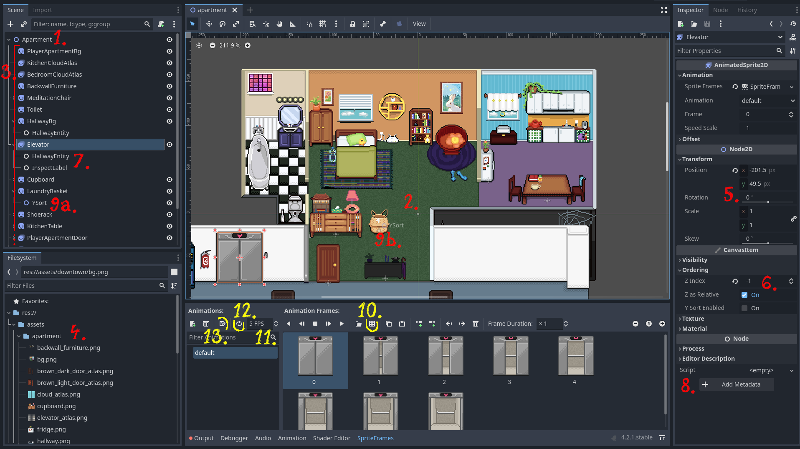

# Using Godot Scene Maker

Since Bevy does not have a built-in editor, we utilize Godot to create scenes.
Godot exports each scene into a text file using its custom configuration format [`.tscn`][godot-tscn].
We parse these `.tscn` files into a representation that can be spawned into a Bevy world.
It's important to note that we currently support only a limited subset of what a Godot scene (and `.tscn` files by extension) can contain.
Any unexpected input is handled with aggressive error reporting.

Here's a brief overview of the Godot editor:

1. Each scene in Godot has some root node.
   For our purposes, we use `Node2D` type and name it after the particular scene.
2. Since Bevy is centered at `(0px, 0px)`, the 2D Godot is also centered there.
3. Children of the root node are then images and atlases rendered in the scene.
   While nodes can be arbitrarily nested, keeping the scene flat is recommended
   for [ysorting](#ysorting).
   We support:
   - `Sprite2D` for a single image
   - `AnimatedSprite2D` for an [atlas](#atlases)
   - `Node2D` for other positional data such as waypoints or [ysorting](#ysorting)
   - `Node` for [components](#components)
4. Godot sees the same assets that bevy does.
5. 2D nodes can be positioned by dragging them or by the numeric input.
   Sometimes to align things perfectly you need to use the numeric input to add half a pixel.
   Rotation, scale and skew are not supported.
6. Z-index is used to determine the order of rendering.
   The higher the z-index, the closer the object is to the camera.
   This input sets the z-index to a static number.
   Use numbers smaller equal to -1 or larger equal to 2.
   The interval `(-1, 2)` is reserved for [ysorting](#ysorting).
7. As mentioned above, `Node` type is used for our specific in-game logic.
   It has no position and can only hold metadata.
8. Metadata can be added and change here.
   See the [documentation](#components) for the relevant component to understand what metadata is required.
9. [`YSort`](#ysorting) is a name of a `Node2D` that's a child of `Sprite2D` or `AnimatedSprite2D`.
   Any node that has this child _must_ have their z-index set to 0.
   Typically we want to position it to the bottom of the sprite.
   As the name suggests, only the y-coordinate is used to determine the order of rendering.
   - **a.** shows the child node
   - **b.** shows how it can be positioned

## Atlases

Godot uses `AnimatedSprite2D` for atlases.
When you create this node, go to the _Inspector_ in the left panel and under the _Animation_ section add a new _Sprite Frames_.

10. Opens a window where you can load an image and cut it into frames.
11. Sets the FPS.
    This setting is only applicable at the moment if auto-play is enabled (see below.)
12. Loops the animation.
    By default, once the animation is finished, it stays on the last frame.
13. Auto-plays the animation.

## Ysorting

TODO

## Components

The purpose of components is to extend the functionality of sprites.
There are some scene specific components and others that can be used across multiple scenes.

Components sometimes require metadata that specify or alter their behavior.
A quirk of Godot is that it capitalizes the first letter of the key in the editor, albeit it stores it in the text file as it is.
For this reason metadata keys are not case sensitive, but the values are case sensitive.

Here's an exhaustive list of components (`Node` type with the name) and their metadata:

- `InspectLabel` defines interaction with an in-game object. See also [_Inspecting the World_](ability_to_inspect.md). It is limited to [top down scenes](top_down.md).
  - `label` is the text to display on the object
  - `action` is an optional name of event to fire when the object is interacted with
  - `zone` is an optional name of a local tile kind that the player must be in to interact with the object
  - `category` is optional, see [_Inspecting the World: Categories_](ability_to_inspect.md#categories)
- `HallwayEntity` is a component with no metadata in the `Apartment` scene.

<!-- List of References -->

[godot-tscn]: https://docs.godotengine.org/en/stable/contributing/development/file_formats/tscn.html
