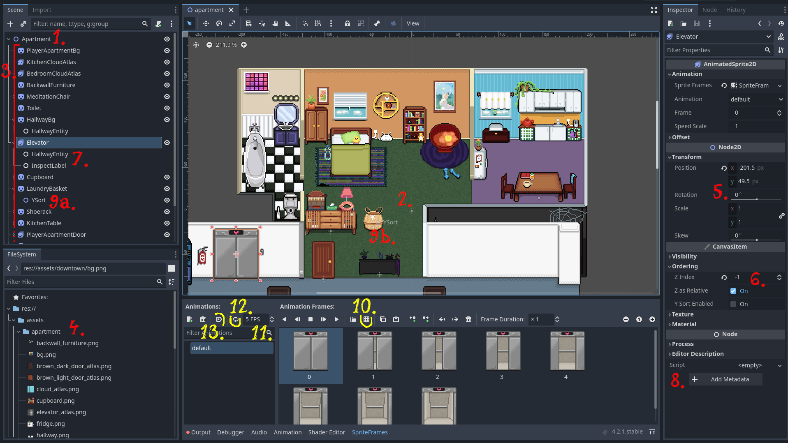
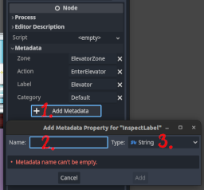

# Using Godot Scene Maker

Since Bevy does not have a built-in editor, we utilize Godot to create scenes.
Godot exports each scene into a text file using its custom configuration format [`.tscn`][godot-tscn].
We parse these `.tscn` files into a representation that can be spawned into a Bevy world.
It's important to note that we currently support only a limited subset of what a Godot scene (and `.tscn` files by extension) can contain.
Any unexpected input is handled with aggressive error reporting.

Here's a brief overview of the Godot editor:

1. Each scene in Godot includes a root node.
   For our purposes, we use the `Node2D` type and name it after the specific scene.
2. Both Bevy and 2D Godot are centered at `(0px, 0px)`.
3. The root node's children consist of images and atlases rendered in the scene.
   While nodes can be nested arbitrarily, it's recommended to keep the scene flat for [ysorting](#ysorting).
   We support the following:
   - `Sprite2D` for a single image
   - `AnimatedSprite2D` for an [atlas](#atlases)
   - `Node2D` for other positional data like waypoints or [ysorting](#ysorting)
   - `Node` for [components](#components)
4. Godot utilizes the same assets as Bevy.
5. Positioning 2D nodes can be done by dragging them or through numeric input.
   Sometimes, to align objects perfectly, you may need to use numeric input to adjust by half a pixel.
   However, rotation, scale, and skew are not supported.
6. Z-index determines the rendering order, with higher values indicating closer proximity to the camera.
   This input sets the z-index to a static number, with values equal to or smaller than -1, or equal to or larger than 2.
   The interval `(-1, 2)` is reserved for [ysorting](#ysorting).
7. The `Node` type is utilized for [specific in-game logic](#components).
   It doesn't have a position and can only contain metadata.
8. Metadata can be added and modified here.
   Refer to the [documentation](#components) for the relevant component to understand the required metadata.
9. [`YSort`](#ysorting) is the name of a `Node2D` that's a child of either `Sprite2D` or `AnimatedSprite2D`.
   Any node with this child must have its z-index set to 0.
   Typically, it's positioned at the bottom of the sprite.
   As the name suggests, only the y-coordinate is used to determine the rendering order.
   - **a.** demonstrates the child node
   - **b.** shows how it can be positioned

## Atlases

Godot utilizes `AnimatedSprite2D` for atlases.
When creating this node, navigate to the _Inspector_ in the left panel, and under the _Animation_ section, add a new _Sprite Frames_.

10. This action opens a window where you can load an image and divide it into frames.
11. Adjusts the frames per second (FPS).
    This setting is only relevant if auto-play is enabled (see below).
12. Specifies whether the animation loops.
    By default, once the animation finishes, it remains on the last frame.
13. Automatically plays the animation.

## Ysorting

Ysorting is a technique to render sprites in a top-down scene.
It's a way to ensure that sprites are rendered in the correct order based on their y-coordinate.

To apply ysorting to a node, the y-index must be set to **0** on the sprite node (default) and a new child node of type `Node2D` named `YSort` must be added.

Unlike Godot, Bevy's ysorting does not necessitate sibling relationships.
This flexibility enables us to utilize nested nodes centered at `(0px, 0px)` to streamline our scenes.
The default z-index when no `YSort` component is included is **0** (technically [this][f32-epsilon]).

For example, if a parent node has a z-index of 2 and the child node has a z-index of 1, the global z-index of the child node is 3.

It's important to use `YSort` only at the child nodes.
If both parent and child have this, the z-index is added which does't make sense in terms of positioning.

When considering the z-index, think of it as the "stacking order" of sprites within the scene.
Imagine each sprite as a card placed on a table, where the z-index determines the order in which the cards are stacked.
The higher the z-index, the closer the sprite appears to the viewer.
For instance, if a sprite has a higher z-index value than another sprite, it will be rendered on top of the latter, regardless of their y-coordinates.
This hierarchical arrangement allows for precise control over the rendering order, ensuring that sprites are displayed correctly within the scene.

## Supported settings:

- Visibility / Visible check box
- Visibility / Self Modulate color
- Ordering / Z Index
- Offset / Flip H
- Offset / Flip V

## Components

The purpose of components is to enhance the functionality of sprites.
There are scene-specific components and others that can be utilized across multiple scenes.

Components sometimes require metadata to specify or alter their behavior.

1. Add a new metadata in the _Inspector_
2. A quirk of Godot is that it capitalizes the first letter of the key in the editor, although it stores it in the text file as it is.
   For this reason, metadata keys are not case-sensitive, but the values are case-sensitive.
3. Metadata values are always strings.

Here's an exhaustive list of components (defined as `Node` type with their names) and their metadata:

- `InspectLabel`: Defines interaction with an in-game object.
  See also [_Inspecting the World_](ability_to_inspect.md).
  This component is limited to [top-down scenes](top_down.md).

  - `label`: The text to display on the object.
  - `action`: An optional name of the event to fire when the object is interacted with.
  - `zone`: An optional name of a zone tile kind that the player must be in to interact with the object.
  - `category`: Optional. See [_Inspecting the World: Categories_](ability_to_inspect.md#categories).

- `Point`: A component with no metadata.
  It's used to define a point in the scene, such as a waypoint or a spawn point.
  To add this component to an entity, create a child plain node named `Point`.

- `HallwayEntity`: A component with no metadata in the `Building1PlayerFloor` scene.

## TODO

- [ ] Add a component that starts an animation when the player gets close.
      Would be useful for bugs, my other butterfly request and also the escalator maybe.
- [ ] We need to be able to change the frequency of animation in godot.

<!-- List of References -->

[godot-tscn]: https://docs.godotengine.org/en/stable/contributing/development/file_formats/tscn.html
[f32-epsilon]: https://doc.rust-lang.org/std/primitive.f32.html#associatedconstant.EPSILON
