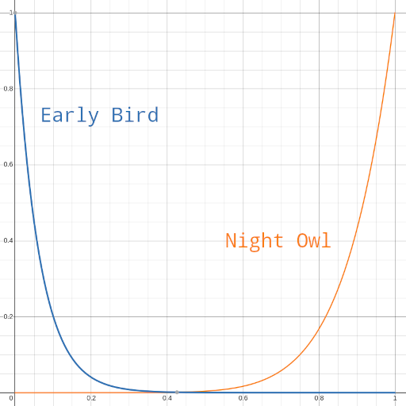

# Character trait system

TODO

## List of traits

### Night Owl

A night owl gets discount on all actions performed later in the day.
We remember how many beats did this trait save the player throughout the day and tell them at the end of the day.

There's a parameter `full_discount` which is a percentage in the form of a decimal fraction (e.g. 7 % is `0.07`).
The full discount is a discount on an action at the end of the day.
In practice, this discount is lower.
It's given by the formula `(elapsed_beats / beats_in_a_day)^8` which gives this curve where `x` is `elapsed_beats` and `y` is the discount:

### Early Bird

Analogous to Night Owl, Early Bird gets discount on all actions performed earlier in the day.

The discount is given by the formula `e^(-16 * elapsed_beats / beats_in_a_day)`.

See [Night Owl](#night-owl) for the curve picture.
